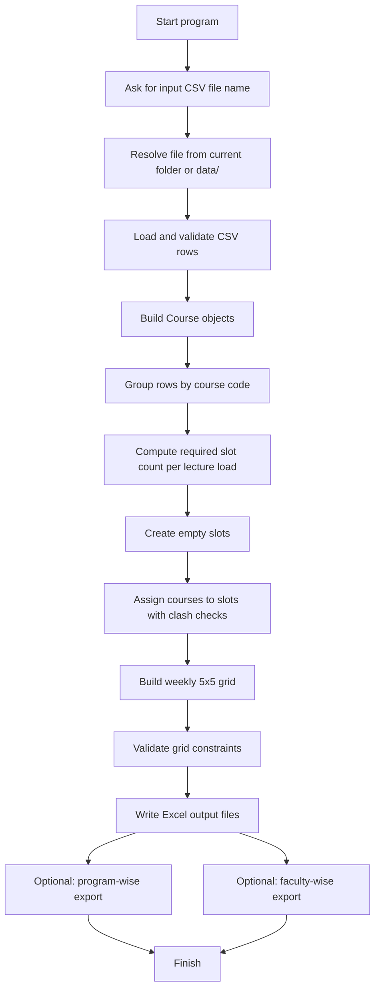

# TimeTableGenerator Project Overview

## What This Project Does

TimeTableGenerator is a C++ academic scheduling tool that reads course data from CSV files, groups related course rows, assigns them into conflict-free lecture slots, and exports the final timetable as Excel workbooks.

It is designed around deterministic scheduling rules:

- Only `Core` courses are auto-scheduled.
- Courses are grouped by course code so shared lectures are placed together.
- Program/semester clashes are avoided.
- Faculty clashes are avoided.
- The weekly grid is built as a `5 x 5` timetable.
- Output is written as `.xlsx` workbooks that can be opened in Excel.

---

## Complete Flow



### Step-by-step execution

1. The program starts in `src/main.cpp`.
2. It asks for the input CSV file name.
3. The input path is resolved automatically:
   - first it tries the exact file name,
   - then it tries `data/<filename>`.
4. `loadCoursesFromCsv()` reads the CSV and creates a `Course` object for every valid row.
5. `CourseCatalog` groups rows by course code.
6. `computeRequiredSlots()` counts how many slots are needed for 1-, 2-, and 3-lecture courses.
7. `buildSlots()` creates numbered slot objects such as `M1`, `M2`, `M3`.
8. `assignCoursesToSlots()` places each course group into a compatible slot.
9. `buildWeeklyGrid()` schedules those slots into a weekly `5 x 5` grid.
10. `validateGrid()` re-checks the final timetable for clashes.
11. The program writes Excel workbooks for:
    - the slot breakdown,
    - the master timetable,
    - optional program-wise timetable,
    - optional faculty-wise timetable.

---

## Project Structure

### `src/main.cpp`
Controls the full CLI flow:

- prompts the user,
- resolves input file names,
- loads course data,
- calls the scheduler,
- writes the output workbooks,
- handles optional program-wise and faculty-wise exports.

### `src/CourseLoader.cpp`
Reads and validates CSV input.

- checks the row format,
- parses lecture count and semester,
- throws clear errors for malformed input.

### `src/TimetableGenerator.cpp`
Contains the scheduling logic and Excel export.

- computes slot requirements,
- builds slots,
- assigns courses to slots,
- creates the weekly grid,
- validates the grid,
- writes `.xlsx` files.

### `include/Slot.hpp`
Defines how a slot stores assignments and performs clash checks.

### `include/CourseCatalog.hpp`
Groups raw course rows by course code.

### `include/Constants.hpp`
Defines timetable size constants such as days, periods, and start hour.

---

## Scheduling Rules

The project uses the following constraints while building the timetable:

- A slot can only contain courses with the same weekly lecture count.
- A slot cannot repeat the same program and semester combination.
- A slot cannot repeat the same faculty member.
- The same slot is not repeated on the same day.
- Faculty members are not scheduled back-to-back in adjacent periods.

This keeps the final timetable consistent and conflict-free.

---

## Input Format

The input CSV uses these columns:

`Code, Course Name, Lecture(L-T-P-C), Type, Faculty, Program, Sem`

Example:

```text
IT205,Data Structures,3-0-0-3,Core,SDG,ICTA,2
```

Notes:

- `Lecture` uses the leading number as lectures per week.
- `Core` rows are scheduled.
- Non-core rows are read but not auto-slotted.
- `0-lecture` rows are treated as out-of-scope for auto-scheduling.

---

## Output

The program creates Excel workbooks (`.xlsx`) for:

- slot breakdown,
- master timetable,
- program-wise timetable,
- faculty-wise timetable.

The output is workbook-based rather than CSV-based, so the result opens directly in Excel or Google Sheets.

---

## Resume-Ready Description

### Short Version

Built a production-style C++ timetable generator that reads academic course data from CSV, groups shared lectures by course code, computes slot demand, and produces clash-free weekly timetables with Excel output. The project emphasizes STL-based design, deterministic scheduling, validation, and clean CLI-driven workflow.

### Bullet Points for Resume

- Designed and implemented a C++ timetable generator that reads CSV-based course data, groups shared lectures by course code, and produces clash-free weekly schedules.
- Built scheduling logic to respect program/semester and faculty constraints while generating a `5 x 5` weekly grid.
- Replaced manual data handling with STL containers such as `vector`, `map`, `set`, `unordered_set`, and custom domain structs.
- Added input validation, deterministic slot assignment, and post-build timetable validation to prevent silent scheduling errors.
- Implemented Excel workbook export for master, slot-wise, program-wise, and faculty-wise timetables.
- Structured the project into modular components for course loading, course grouping, scheduling, validation, and output generation.

### JD-Aligned Version

This project demonstrates strong C++ fundamentals, STL usage, object lifetimes, deterministic data processing, and modular system design. It shows experience building a data-driven scheduling engine with careful constraint handling, validation, and production-style output generation. The work also reflects attention to code quality, reproducibility, and implementation detail, which aligns well with performance-sensitive systems engineering roles.

---

## How to Present It in an Interview

If asked to explain the project, describe it in this order:

1. Problem statement: automatically generate a university timetable from course data.
2. Core idea: group courses by code, compute required slots, and place them into a weekly grid.
3. Constraints: avoid program clashes, faculty clashes, and repeated same-day placement.
4. Engineering detail: use STL containers, validation, and Excel export.
5. Outcome: a repeatable, conflict-free timetable generator with optional filtered views.

---

## Suggested One-Line Resume Project Summary

Built a modular C++ timetable generator that reads course CSVs, schedules conflict-free weekly slots under program and faculty constraints, validates the final grid, and exports Excel workbooks for master, program-wise, and faculty-wise timetables.
