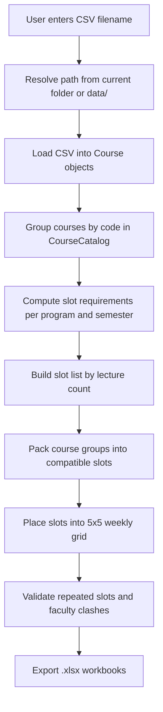

# TimeTableGenerator Final Explanation

## Overview

TimeTableGenerator is a C++ academic timetable generator that reads course data from CSV files, groups related offerings, computes the number of weekly slots needed, assigns courses to slots while avoiding clashes, places those slots into a weekly grid, validates the result, and exports the final timetable as Excel workbooks.

It is designed to handle real academic constraints:

- shared lectures across multiple programs
- different semester batches
- faculty clash avoidance
- repeated slot avoidance on the same day
- consecutive-period faculty clash avoidance
- generation of program-wise and faculty-wise timetable views

The project currently produces real `.xlsx` files, not plain text CSV exports.

---

## What the Project Reads

The input is a CSV file where each row describes one course offering.

Typical columns:

- Course code
- Course name
- Lecture pattern like `3-0-2-4`
- Type such as `Core`
- Faculty short name
- Program
- Semester

Only the lecture count part of the lecture pattern is used for scheduling. For example:

- `3-0-2-4` means 3 lectures per week
- `1-0-2-2` means 1 lecture per week
- `0-0-2-1` means a 0-lecture row, which is out of scope for auto-placement in the current algorithm

---

## Complete File Structure

### `src/main.cpp`

This is the entry point.

Responsibilities:

- ask the user for the input CSV filename
- automatically resolve the file from `data/` if needed
- load courses
- compute slot requirements
- build slots
- assign courses to slots
- build the weekly grid
- validate the grid
- write Excel outputs
- handle program-wise and faculty-wise export requests

### `src/CourseLoader.cpp`

Reads the CSV input and converts each valid row into a `Course` object.

Responsibilities:

- open the file
- split each CSV row
- validate field count
- parse lecture count and semester
- throw readable errors if the CSV is malformed

### `src/TimetableGenerator.cpp`

Contains the core scheduling pipeline.

Responsibilities:

- compute slot requirements
- build the slot list
- assign courses to slots
- build the weekly timetable grid
- validate the final grid
- export `.xlsx` files

### `include/Course.hpp`

Defines the `Course` object.

A `Course` stores:

- code
- name
- lectures per week
- type
- faculty
- program
- semester

### `include/CourseCatalog.hpp`

Groups courses by code.

If the same course code appears for multiple programs or semesters, it is stored together as one course group.

### `include/Slot.hpp`

Defines a weekly slot.

A `Slot` stores:

- slot number like `M1`
- lecture count requirement
- assigned course offerings
- used program/semester combinations
- used faculty names

### `include/PriorityScheduler.hpp`

Manages weekly placement priority.

It keeps slots ordered by how many weekly placements they still need.

### `include/TimetableGenerator.hpp`

Declares the scheduler functions and export functions.

### `include/Constants.hpp`

Defines constants like:

- number of days
- number of periods
- start hour
- free slot value

---

## Complete Flow

### 1. Start the program

The user runs the executable.

The program asks for the input file.

If the user types just a filename like `autumn.csv`, the program checks:

1. whether `autumn.csv` exists in the current directory
2. if not, whether `data/autumn.csv` exists

This makes usage simpler.

### 2. Load input rows

Each CSV row becomes a `Course` object.

The loader validates:

- the row has exactly 7 fields
- lecture count can be parsed
- semester can be parsed

If not, it throws an error with the line number.

### 3. Group identical course codes

The `CourseCatalog` groups all Core course rows by code.

Why this matters:

- one course code may be taught to many programs
- those rows should be scheduled together, not separately
- this prevents duplicate scheduling of the same lecture

### 4. Compute how many slots are needed

The scheduler scans all Core courses.

It counts, for each `(program, semester)` pair:

- how many 1-lecture courses exist
- how many 2-lecture courses exist
- how many 3-lecture courses exist

Then it takes the maximum of each count across all program/semester combinations.

This gives the number of slots required for each lecture size.

### 5. Create slots

The program creates empty slots in this order:

- all 3-lecture slots first
- then 2-lecture slots
- then 1-lecture slots

This matches the intended priority of heavier courses being scheduled first.

### 6. Pack courses into slots

Each course group is tested against each slot.

A group can be added only if:

- its lecture count matches the slot
- the same program/semester is not already used in that slot
- no faculty in the group is already used in that slot

If it fits, the entire group is placed together.

### 7. Build the weekly grid

The weekly grid is a 5 × 5 matrix.

- 5 days
- 5 periods per day

The scheduler uses a priority queue-like structure to place slots by remaining demand.

Rules during placement:

- a slot cannot repeat on the same day
- a slot cannot cause consecutive faculty conflict
- if a candidate does not fit, the algorithm tries the next one
- if nothing fits, the cell stays free

### 8. Validate the final result

After the grid is built, the program checks for:

- repeated slots on the same day
- faculty clashes in adjacent periods

This is a safety check to catch mistakes or impossible placements.

### 9. Export workbook files

The program writes `.xlsx` workbooks for:

- slot breakdown
- master timetable
- program-wise semester timetable
- faculty timetable

These are valid Excel workbook files with the required XML parts inside.

---

## How The Algorithm Works Internally

This section explains the exact logic more deeply.

### A. Demand calculation

The first key step is finding how many slots are needed.

Pseudo logic:

```text
for each course:
    ignore if not Core
    ignore if lecture count is 0 or greater than 3
    count it by program, semester, and lecture size

for each program-semester group:
    required_1 = max(required_1, count of lecture-1 courses)
    required_2 = max(required_2, count of lecture-2 courses)
    required_3 = max(required_3, count of lecture-3 courses)
```

This ensures the timetable has enough capacity for the busiest batch.

### B. Grouping logic

Course rows with the same code are grouped together.

Example:

If `HM106` appears for `ICTA-2`, `ICTB-2`, and `CS-2`, all three rows become one group.

This group is then scheduled together so the same lecture is not duplicated.

### C. Packing logic

The slot packing is greedy.

That means:

- the algorithm does not search every possible arrangement
- it makes the first valid choice that fits the constraints
- it continues forward instead of backtracking

This is simple, fast, and suitable for the project size.

### D. Priority scheduling logic

Each slot has a weekly frequency.

Examples:

- lecture-3 slot needs 3 placements in the week
- lecture-2 slot needs 2 placements
- lecture-1 slot needs 1 placement

The scheduler always picks the slot with the highest remaining priority first.

This means heavy courses are placed before light courses.

### E. Grid placement logic

The weekly grid is filled cell by cell.

For each day and period:

1. get the best remaining slot
2. check if it repeats on the same day
3. check if it causes back-to-back faculty clash
4. place it if valid
5. otherwise try the next slot

If no valid slot exists, that cell is left free.

### F. Validation logic

After placement, the algorithm runs one more pass to verify the rules.

It checks:

- duplicate slots on the same day
- faculty clashes between consecutive periods

This helps detect problems even if the packing step changed later.

---

## Mermaid Flow Diagram



---

## Important Constraints

The current algorithm intentionally supports these rules:

- only Core courses are auto-scheduled
- only lecture counts 1, 2, and 3 are used for auto-placement
- 0-lecture rows are reported separately as out of scope
- a program/semester cannot appear twice inside the same slot
- the same faculty cannot appear twice in one slot
- the same slot cannot repeat on the same day
- the same faculty should not appear in consecutive periods

---

## What Changed From the Old Version

The old implementation used manual structures like linked lists and fixed arrays.

The current version replaces that with STL-based code:

- `std::map` for grouping course data
- `std::vector` for slot lists and grids
- `std::set` and `std::unordered_set` for clash tracking
- `std::multimap`-style priority handling for weekly placement

This makes the code easier to read, safer, and more maintainable.

---

## How To Build And Run

### Build

```powershell
g++ -std=c++17 -O2 -Wall -Wextra -Iinclude src\main.cpp src\CourseLoader.cpp src\TimetableGenerator.cpp -o timetable.exe
```

### Run

```powershell
.\timetable.exe
```

When prompted for the input file, type only:

```text
autumn.csv
```

The program will automatically try `data/autumn.csv`.

Then enter the output workbook names when prompted.

---

## Example User Interaction

```text
Enter the name of the input CSV file : autumn.csv
Enter the name of the xlsx file to save the slots : slots.xlsx
Enter the name of the xlsx file for time-table : timetable.xlsx
```

Then the program may ask for:

- program-wise timetable export
- faculty-wise timetable export
- finish

---

## Resume-Ready Summary For Obsidian Capital

### Short Summary

Built a modern C++ timetable generation system that loads course CSV data, groups shared lectures, computes slot demand, performs greedy clash-free slot allocation, validates the final schedule, and exports Excel workbooks for master, program-wise, and faculty-wise views.

### Resume Bullets

- Designed and implemented a modular C++17 scheduling pipeline using STL containers and deterministic placement logic.
- Replaced manual linked-list and fixed-array structures with `std::map`, `std::vector`, `std::set`, and `std::unordered_set` for safer and cleaner data handling.
- Built a constraint-driven timetable generator that groups shared course offerings, computes required slot counts per batch, and avoids program and faculty clashes.
- Implemented a greedy weekly placement algorithm that prioritizes higher-frequency slots and prevents repeated-day and consecutive-period conflicts.
- Added validation logic to detect timetable inconsistencies after generation.
- Created native `.xlsx` exports for slot breakdowns, master timetables, program-wise views, and faculty-wise views.
- Improved usability by auto-resolving input filenames from `data/` and supporting prefix-based semester lookup like `ICT` for `ICTA` and `ICTB`.

### JD-Aligned Description

This project matches the engineering style expected in performance-sensitive C++ roles: it requires careful data modeling, deterministic scheduling logic, validation, modular design, and clean production-grade implementation.

### Final Resume Paragraph

Modern C++ developer with hands-on experience building a modular timetable generation system that reads and validates CSV input, groups shared lecture offerings, computes schedule capacity, resolves clash-free slot allocation, validates the final grid, and exports Excel-based timetables. Strong focus on STL-based design, deterministic behavior, clean code structure, and reliable output generation.

---

## One-Line Project Description

A C++17 timetable generator that reads CSV course data, computes required lecture slots, schedules courses without clashes, and exports Excel timetables for the full batch, individual programs, and faculty members.

---

## Notes On Current Behavior

- Input filenames are resolved automatically from `data/`.
- `ICT` semester-wise export matches `ICTA` and `ICTB` through prefix lookup.
- 0-lecture rows are reported separately instead of being treated as placement failures.
- The generated timetable is validated after placement.

---

## Why The Algorithm Is Reliable

The algorithm is reliable because it follows a strict order:

1. count demand first
2. group related course rows
3. build enough slots
4. place only compatible groups
5. fill the weekly grid with priority ordering
6. validate the result
7. export after verification

That sequence prevents the timetable from being built on incomplete or inconsistent assumptions.
